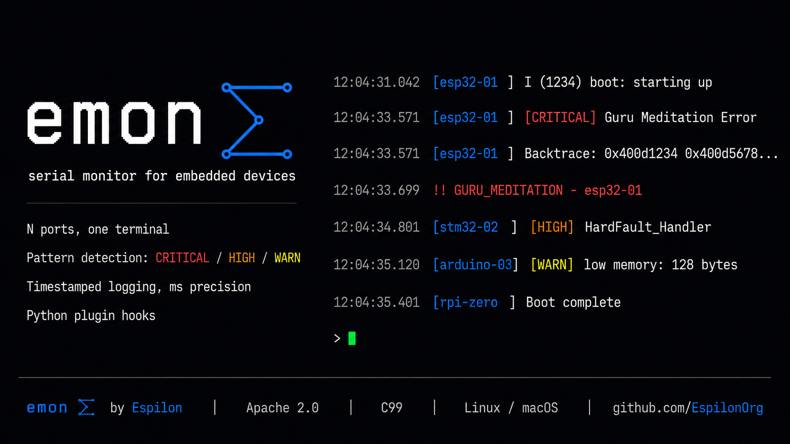

# emon



**Universal serial monitor for embedded devices.**

[](https://github.com/Eun0us/espilon-monitor/actions/workflows/ci.yml)
[](LICENSE)

Monitor any number of serial devices simultaneously — production boards, dev kits, test rigs — from a single terminal, with pattern detection, structured logging, and CI integration built in.

---

## The Problem

You have boards. They output things on serial. You need to know what's happening.

With one board and one terminal, `screen` works fine. With five boards running 24/7, it breaks down: missed events, no logging, no alerting, no context when something goes wrong.

`emon` gives you a unified view of all your devices, with the intelligence to tell you what matters.

---

## What it does

```
emon  4 ports
─────────────────────────────────────────

[bot-alpha ] online @ 115200 baud  [family: espilon]
[bot-beta  ] online @ 115200 baud  [family: espilon]
[dev-board ] online @ 115200 baud  [family: esp32]
[target-ble] online @ 115200 baud  [family: esp32]

12:04:31.042 [sensor-01 ] Temperature: 23.4C  humidity: 61%
12:04:32.198 [sensor-02 ] Motion detected on GPIO4
12:04:33.571 [esp32-dev ] [CRITICAL] Guru Meditation Error: Core 0 panic'd
12:04:33.571 [esp32-dev ]   !!  GURU_MEDITATION -- esp32-dev
12:04:34.802 [stm32-board] [HIGH] HardFault_Handler called
```

- **N ports, one view** — read from any number of serial devices at the same time
- **Pattern detection** — define what "interesting" looks like per device or globally
- **Severity levels** — CRITICAL / HIGH / WARN / INFO, filter the noise
- **Full logging** — every byte, timestamped, per device, with rolling rotation
- **Event context** — capture the lines before and after a trigger
- **Auto-reset** — assert RTS/DTR on a CRITICAL event automatically
- **Interactive mode** — send commands to any device from the monitor (`-i`)
- **Hex dump** — inspect raw binary streams (`--hex`)
- **CI/test runner** — `--wait-for BOOT_OK --timeout 30` exits with the right code
- **Event hooks** — call a Python script on every matched event (`--on-event`)

---

## Use cases

**Operations / fleet management**
Monitor a fleet of ESP32 devices running autonomous tasks. Get alerted when one crashes, goes silent, or outputs an unexpected state. Log everything for post-mortem.

**Development**
Replace five terminal windows with a single view. See all boards during a test session. Spot regressions instantly. Use `--hex` to debug binary protocols.

**Security research**
Monitor embedded targets during assessments. Classify faults in real time, auto-reset and continue. Detect stack dumps, fault handlers, unexpected resets.

**CI / test automation**
Feed inputs to a device under test, watch for expected output patterns, exit with the right code. Integrates with any CI runner via `--json-events` and `--wait-for`.

---

## Supported devices

Anything with a UART serial output. Built-in pattern families:

| Family | Examples |
|--------|---------|
| ESP-IDF | ESP32, ESP32-C6, ESP32-S3, ESP32-H2 |
| STM32 | Any STM32 with standard fault output |
| Arduino | AVR, ARM, ESP8266 |
| Zephyr RTOS | Kernel panics, assertions |
| FreeRTOS | Stack overflow, heap corruption |
| exploit | Fault classification for security research |
| Custom | Define your own `.pat` file |

---

## Quick start

```bash
# Build (requires gcc + make)
make

# Optional: install system-wide
sudo make install      # → /usr/local/bin/espilon-monitor + man page

# Or just symlink
ln -s $PWD/espilon-monitor ~/.local/bin/emon
```

```bash
# Monitor one device
emon /dev/ttyUSB0

# Monitor 3 devices at once
emon /dev/ttyACM0 /dev/ttyUSB0 /dev/ttyUSB1

# Name your devices
emon --name /dev/ttyACM0=alpha --name /dev/ttyUSB0=beta /dev/ttyACM0 /dev/ttyUSB0

# Auto-detect chip family and log to disk
emon --auto-patterns patterns/ --logdir ./logs /dev/ttyUSB0

# Background daemon
emon --bg --logdir /opt/logs /dev/ttyUSB1
emon stop

# Interactive: send input to device (Ctrl+A X = quit, Ctrl+A [ = scrollback)
emon -i /dev/ttyUSB0

# Split-pane TUI (one pane per device)
emon --tui /dev/ttyUSB0 /dev/ttyUSB1

# Hex dump mode (raw bytes + ASCII, pattern detection still active)
emon --hex /dev/ttyUSB0

# Flow control
emon --flow-control rtscts /dev/ttyUSB0

# Call a Python script on every matched event
emon --on-event hooks/alert.py --patterns patterns/esp32.pat /dev/ttyUSB0

# CI/test runner: wait for pattern, exit 0 on success / 124 on timeout
emon --wait-for BOOT_COMPLETE --timeout 30 /dev/ttyUSB0

# Machine-readable JSON event stream
emon --json-events --exit-on GURU_MEDITATION /dev/ttyUSB0
```

---

## Pattern files

Pattern files are plain text — no recompile needed:

```
# patterns/esp32.pat
CRITICAL  GURU_MEDITATION   Guru Meditation Error
CRITICAL  ABORT             abort\(\) was called
HIGH      STACK_OVERFLOW    stack overflow
WARN      RESET             rst:0x
INFO      BOOT              I \([0-9]+\) boot:
```

Format: `SEVERITY  NAME  REGEX`

- `SEVERITY` — `CRITICAL`, `HIGH`, `WARN`, or `INFO`
- `NAME` — short uppercase identifier (used with `--exit-on` / `--wait-for`)
- `REGEX` — POSIX extended regex matched against each output line

Load with `--patterns mydevice.pat`. Use `--auto-patterns patterns/` to auto-detect the family from USB VID/PID and load the matching file automatically.

See [CONTRIBUTING.md](CONTRIBUTING.md) for how to add a new family (no C, no recompile).

---

## Config file

All CLI flags can be set in a config file and loaded with `--config`:

```ini
# .emon.conf
baud          = 115200
flow_control  = none          # none | rtscts | xonxoff
logdir        = ./logs
auto_patterns = patterns/
verbose       = true
color         = true
timestamps    = true
context       = 10
timeout       = 60
json_events   = false
tui           = false
hex           = false

# Additive — one per line
pattern       = patterns/esp32.pat
pattern       = patterns/custom.pat

on_event      = hooks/alert.py
on_event      = hooks/slack.py
```

A fully commented reference is available in [`.emon.conf.example`](.emon.conf.example).

---

## Event hooks (`--on-event`)

When a pattern matches, emon calls your script with a JSON payload on stdin:

```json
{
  "rule":     "GURU_MEDITATION",
  "severity": "CRITICAL",
  "device":   "ttyUSB0",
  "line":     "Guru Meditation Error: Core 0 panic'd (LoadProhibited)",
  "ts":       1718000000000
}
```

```python
# hooks/alert.py
import json, sys
ev = json.load(sys.stdin)
if ev["severity"] == "CRITICAL":
    print(f"[ALERT] {ev['device']}: {ev['rule']}")
```

Up to 8 hooks per session. Each runs as a fire-and-forget subprocess — the monitor is never blocked. See [docs/hooks.md](docs/hooks.md) for the full payload spec and more examples (ntfy, Slack, Discord).

---

## Architecture

```
src/
├── main.c                  # Entry point, CLI, signal handling
├── app/
│   ├── config.c/.h         # CLI + config file parsing
│   └── daemon.c/.h         # Background daemon (double-fork, PID file)
├── monitor/
│   ├── monitor.c/.h        # Main loop — one pthread per port
│   ├── detector.c/.h       # Pattern matching (POSIX regex, O(1) dedup)
│   └── recorder.c/.h       # Per-device logging + event context + log rotation
├── serial/
│   ├── serial.c/.h         # libserialport I/O, auto-detect, flow control
│   └── reset.c/.h          # Hardware reset via RTS/DTR
└── ui/
    ├── display.c/.h         # Terminal output, hex dump renderer
    ├── interactive.c/.h     # Bidirectional stdin↔device
    ├── scrollback.c/.h      # In-process scrollback buffer
    └── tui.c/.h             # Split-pane TUI (native ANSI, no ncurses)

patterns/                    # Pattern rule files per device family
vendor/                      # Vendored libserialport (no system install)
docs/                        # Man page, supplementary guides
hooks/                       # Example --on-event scripts
tests/                       # Detector unit tests + HW test harness
```

**C core**: one thread per port, minimal overhead. Runs forever without surprises.
**libserialport**: vendored static build — no system dependency.
**Pattern detection**: POSIX regex, O(1) deduplication via open-addressing hash set.

---

## Dependencies

| | Purpose | Required |
|--|---------|---------|
| `gcc` + `make` | Build | Yes |
| `libserialport` | Serial I/O | Vendored (no install) |
| `pthreads` | Per-port threads | Built-in (POSIX) |
| `regex.h` | Pattern matching | Built-in (POSIX) |
| `python3` | `--on-event` hooks | Optional |

---

## License

Apache 2.0 — see [LICENSE](LICENSE).

---

## Contributors

| Role | Profile |
|------|---------|
| Author & Maintainer | [@Eun0us](https://github.com/Eun0us) |

Part of the [Espilon Association](https://espilon.net) open source ecosystem.
