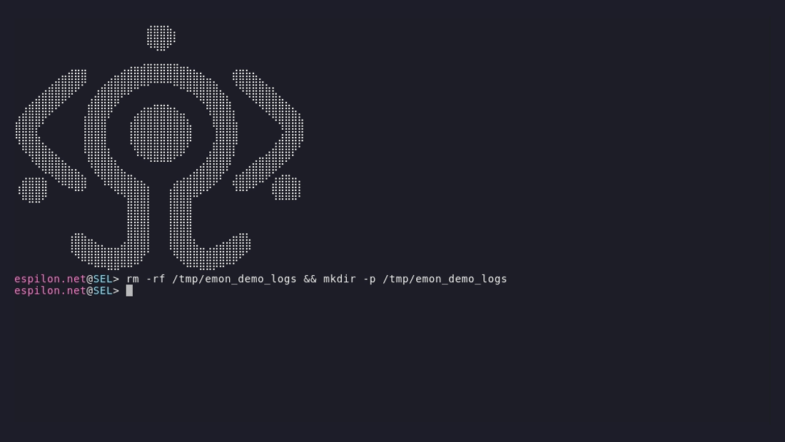

# EMON Espilon Monitor

[](https://github.com/EspilonOrg/emon/actions/workflows/ci.yml)
[](LICENSE)
[](CHANGELOG.md)

**Universal serial monitor for embedded devices.**  
Watch any number of ports simultaneously. Detect crashes and events by pattern.  
Stream structured JSON to your pipeline. Log, react, automate.

---

## Install

```bash
git clone https://github.com/EspilonOrg/emon && cd emon
make
PREFIX=~/.local make install       # → ~/.local/bin/emon  (no sudo needed)
```

The only runtime dependency (`libserialport`) is vendored, no system packages required.

---

## Quick start

```bash
# Raw output from one device
emon /dev/ttyUSB0

# Color-coded events with an ESP32 pattern file
emon --verbose -p patterns/esp32.pat /dev/ttyUSB0

# Two devices, named, at the same time
emon --name /dev/ttyUSB0=ESP32 --name /dev/ttyACM0=Arduino \
     /dev/ttyUSB0 /dev/ttyACM0
```

---

## Demos

### Basic monitoring

Boot sequence and verbose serial output from an ESP32:


---

### Interactive mode

Type commands, capture events in real time, full bidirectional I/O:


```bash
emon -i -p patterns/arduino.pat /dev/ttyACM0
```

| Shortcut | Action |
|---|---|
| `Ctrl+C` | Quit |
| `Ctrl+A X` | Quit |
| `Ctrl+A C` | Send raw `0x03` to device |

---

### JSON event stream

Pure NDJSON on stdout, pipe anywhere:


```bash
emon --quiet --json-events -p patterns/arduino.pat /dev/ttyACM0 | jq .
```

Each event:

```json
{"rule": "OOM", "severity": "CRITICAL", "device": "ttyACM0", "line": "...", "ts": 1718000000000}
```

---

### Multi-port

Two devices, each color-coded, in one terminal:


```bash
emon --verbose \
     --name /dev/ttyUSB0=ESP32 \
     --name /dev/ttyACM0=Arduino \
     /dev/ttyUSB0 /dev/ttyACM0
```

---

### Background daemon

Detach, collect logs, inspect later:



```bash
emon --bg --logdir ./logs -p patterns/esp32.pat /dev/ttyUSB0

emon status          # running (PID 12345)
emon stop            # graceful shutdown
cat logs/ttyUSB0.log
```

---

## Pattern files

```text
# patterns/esp32.pat
CRITICAL  GURU_MEDITATION   Guru Meditation Error
CRITICAL  ABORT             abort\(\) was called
HIGH      STACK_OVERFLOW    stack overflow
WARN      RESET             rst:0x
INFO      BOOT              I \([0-9]+\) boot:
```

Format: `SEVERITY  NAME  REGEX`, one rule per line, POSIX extended regex.  
Severities: `CRITICAL` › `HIGH` › `WARN` › `INFO`

Built-in families: `esp32` · `stm32` · `arduino` · `freertos` · `zephyr` · `esp-idf` · `exploit`

See [CONTRIBUTING.md](CONTRIBUTING.md) to add a new family, no C required, just a `.pat` file.

---

## More features

**CI integration**: exit with the right code when a rule fires or times out:

```bash
emon --wait-for BOOT_OK --timeout 30 /dev/ttyUSB0     # exit 0 on match, 124 on timeout
emon --exit-on "PANIC=1" --timeout 60 /dev/ttyUSB0   # exit 1 on PANIC
```

**Event hooks**: fire a Python script on every match:

```bash
emon --on-event hooks/alert.py -p patterns/esp32.pat /dev/ttyUSB0
```

emon passes a JSON payload on stdin. Fire-and-forget, the monitor never blocks.  
See [docs/hooks.md](docs/hooks.md) for ready-made ntfy, Slack, Discord, and SQLite examples.

**Auto-detect**: load the right pattern file automatically from USB VID/PID:

```bash
emon --auto-patterns patterns/ /dev/ttyUSB0
```

**Config file**: persist all flags in an INI file:

```ini
# .emon.conf
baud         = 115200
logdir       = ./logs
pattern      = patterns/esp32.pat
on_event     = hooks/alert.py
```

```bash
emon --config .emon.conf /dev/ttyUSB0
```

Full reference: [`.emon.conf.example`](.emon.conf.example)

---

## Architecture

```text
src/
  app/        config parsing, daemon mode
  monitor/    main loop, pattern detector, event recorder
  serial/     libserialport I/O, USB auto-detect, hardware reset
  ui/         display, TUI, hex dump, interactive mode
patterns/     .pat rule files per device family
tests/        unit tests (51), hardware test harness
vendor/       vendored libserialport (static, no system install)
```

One pthread per port. Pattern detection uses POSIX regex with an open-addressing hash
set (FNV-1a, 2048 slots) for O(1) deduplication. No ncurses, native ANSI only.

---

## Contributing

See [CONTRIBUTING.md](CONTRIBUTING.md).  
The easiest contribution is a new `.pat` pattern file for a device family you use.

---

## License

Apache 2.0, see [LICENSE](LICENSE).

Part of the [Espilon Association](https://espilon.net) open source ecosystem.
